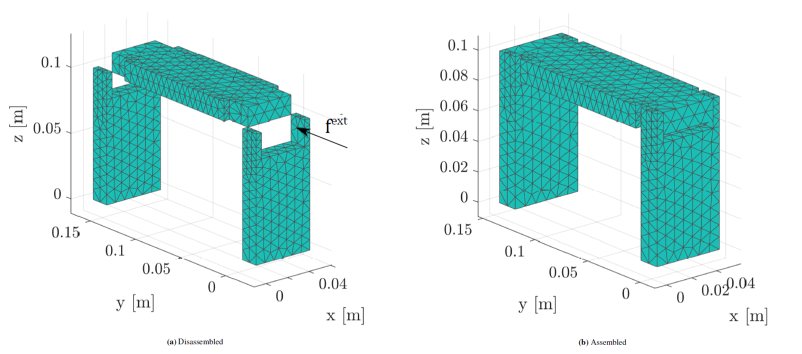

# SLAPPaperMeshFiles

This directory contains the meshes (.bdf-files) and an interface description file for:
F. Naets, T. Devos, A. Humer, J. Gerstmayr: A non-invasive system-level model order reduction scheme for
flexible multibody simulation, International Journal of Numerical Methods in Engineering (2020).

Besides the trivial 'ground' body, The system consists of three component model described by a Nastran compatible mesh file: Bar1, Bar2, and UpperBar. 

## Connectivity overview
First we give an overview of which 'frames' should be defined and then indicate which frames should be joined. 

### Frame overview
Ground body frames (frames defined by position):
G1_L at 1e-3*[0;2.50000023841858;0];
G1_R at 1e-3*[50;2.50000023841858;0];
G2_L at 1e-3*[-7.45058059692383e-7;137.5;0];
G2_R at 1e-3*[50;137.5;0].

Bar1 body frames (frames defined by node IDs):
B1F1 at node 214;
B1F2 at node 279;
B1F3 at node 58;
B1F4 at node 178.

UpperBar body frames (frames defined by node IDs):
B2F1 at node 386; 
B2F2 at node 580;
B2F3 at node 387;
B2F4 at node 581.

Bar2 body frames (frames defined by node IDs):
B3F1 at node 957; 
B3F2 at node 1022;
B3F3 at node 800;
B3F4 at node 920.

### Joint overview
All joints considered are revolute joints:

